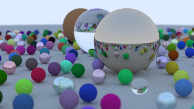
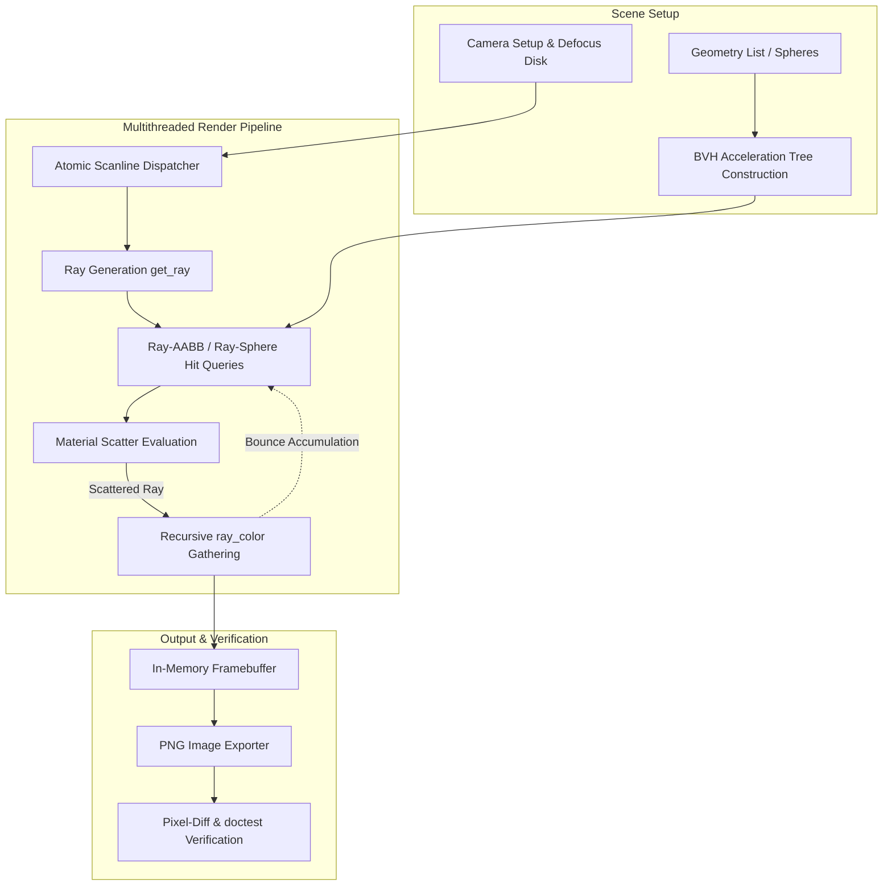

# C++17 CPU Path Tracer

[](https://github.com/durgesh-k-sharma/rtiow/actions/workflows/ci.yml)
[](https://en.cppreference.com/w/cpp/17)
[](https://creativecommons.org/publicdomain/zero/1.0/)

> A high-performance, multithreaded C++17 CPU path tracer implementing realistic light transport, recursive ray scattering, physical materials, defocus blur, and Bounding Volume Hierarchy (BVH) spatial acceleration.

---

## Showcase



*A 480+ sphere scene demonstrating Lambertian diffuse surfaces, brushed and polished metals, dielectric glass refraction with total internal reflection, and thin-lens defocus blur (depth-of-field).*

---

## Features

- **Physically Based Materials**:
  - **Lambertian (Diffuse)**: True hemispherical cosine scattering with zero-scatter handling.
  - **Metal (Conductor)**: Specular ray reflection with tunable surface roughness (`fuzz`).
  - **Dielectric (Glass)**: Snell's law refraction, total internal reflection, and Schlick's polynomial approximation for Fresnel reflectance (including support for hollow glass bubbles).
- **Positionable Camera & Optics**:
  - Full 3D orientation (`lookfrom`, `lookat`, `vup`) and configurable vertical field of view (`vfov`).
  - Depth-of-field defocus blur with randomized thin-lens disk sampling.
- **High-Performance Spatial Acceleration**:
  - Axis-Aligned Bounding Box (`aabb`) with optimized slab intersection calculations.
  - Hierarchical Bounding Volume Hierarchy (`bvh_node`) delivering **>5x rendering acceleration** over linear scene traversals.
- **Multithreaded Rendering Engine**:
  - Dynamic atomic scanline work queue scaling linearly across all available hardware threads via `std::thread`.
- **Zero-Dependency Core & Image I/O**:
  - Direct 24-bit PNG export via vendored `stb_image_write.h` alongside standard PPM output streams.
- **Robust Quality & Regression Testing**:
  - Automated unit test suite powered by `doctest`.
  - Deterministic visual regression checking with a custom per-channel pixel difference analysis tool.

---

## Architecture & How It Works



### Component Breakdown

| Header / Module | Responsibility |
|---|---|
| [`src/vec3.h`](src/vec3.h) | 3D vector math, dot/cross products, reflection, refraction, and geometric sampling. |
| [`src/ray.h`](src/ray.h) | Parametric 3D ray representation ($P(t) = \text{orig} + t \cdot \text{dir}$). |
| [`src/interval.h`](src/interval.h) | 1D numerical interval math with bounds clipping, expansion, and containment checks. |
| [`src/color.h`](src/color.h) | Gamma-2.0 correction ($\sqrt{c}$), clamping, and 8-bit RGB byte packing. |
| [`src/hittable.h`](src/hittable.h) | Abstract ray-intersection interface and `hit_record` surface normal orientation. |
| [`src/sphere.h`](src/sphere.h) | Closed-form quadratic ray-sphere intersection with negative-radius geometry support. |
| [`src/material.h`](src/material.h) | Polymorphic material scatter abstraction (`lambertian`, `metal`, `dielectric`). |
| [`src/aabb.h`](src/aabb.h) | Axis-aligned bounding box bounding volume with optimized slab interval tests. |
| [`src/bvh.h`](src/bvh.h) | Spatial partitioning tree with longest-axis sorting and bounding hierarchy. |
| [`src/camera.h`](src/camera.h) | Viewport geometry, thin-lens ray sampling, ray-depth recursion, and multi-threaded loop. |
| [`src/image_writer.h`](src/image_writer.h) | Encapsulated PNG encoding interface. |

---

## Getting Started

### Prerequisites

- **C++17 compiler**: `g++` (≥ 9.0), `clang++` (≥ 10.0), or MSVC (≥ 2019)
- **Build tools**: `make` or `cmake` (≥ 3.16)
- *All required third-party libraries (`doctest.h`, `stb_image.h`, `stb_image_write.h`) are vendored in `third_party/`.*

### Installation & Compilation

```bash
# Clone the repository
git clone https://github.com/durgesh-k-sharma/rtiow.git
cd rtiow

# Build with Make (default)
make all

# Or configure and build with CMake
cmake -B build -DCMAKE_BUILD_TYPE=Release
cmake --build build --config Release
```

---

## Usage & CLI Reference

### Basic Commands

```bash
# Render the final capstone scene to PNG (default settings)
./build/raytracer --scene final --png output/final.png

# Fast preview with lower resolution and sample count
./build/raytracer --scene final --width 300 --samples 20 --depth 15 --png output/preview.png

# Render preset test scenes
./build/raytracer --scene sky --png output/sky.png
./build/raytracer --scene normals --png output/normals.png
./build/raytracer --scene materials --png output/materials.png

# Output raw PPM format to stdout
./build/raytracer --scene normals > output/scene.ppm
```

### Command-Line Arguments

| Flag | Argument Type | Default | Description |
|---|---|---|---|
| `--scene` | `sky` \| `normals` \| `materials` \| `final` | `final` | Selects scene geometry and camera framing. |
| `--width` | `integer` | `400` | Render image width in pixels (height derived from aspect ratio). |
| `--samples` | `integer` | `100` | Number of antialiasing ray samples per pixel. |
| `--depth` | `integer` | `50` | Maximum ray recursion bounce depth. |
| `--threads` | `integer` | `0` (auto) | Number of worker threads (`0` uses all logical CPU cores). |
| `--bvh` | *flag* | *enabled* | Enables Bounding Volume Hierarchy acceleration. |
| `--no-bvh` | *flag* | — | Disables BVH to run brute-force linear intersection search. |
| `--png` | `filepath` | `""` | Output image directly to a PNG file. |
| `--help`, `-h` | *flag* | — | Displays the command-line usage manual. |

---

## Testing & Benchmarks

### Running Unit Tests

Unit tests are implemented using `doctest` and cover vector arithmetic, ray-sphere collisions, reflection/refraction physics, and AABB slab intersections:

```bash
make test
# or via CTest
ctest --test-dir build --output-on-failure
```

### Visual Regression Testing

A pixel difference tool (`tools/pixel_diff.cc`) compares rendered outputs against golden reference images using configurable per-channel delta thresholds:

```bash
make smoke-test
```

### Performance Benchmark (BVH vs. Linear Search)

Run the built-in benchmark to evaluate spatial acceleration performance on a 480+ sphere scene:

```bash
make bench
```

**Benchmark Results (4-core x86_64, 200×112 @ 20 spp):**
- **Linear Search (No BVH)**: `2.997 seconds`
- **BVH Acceleration**: `0.581 seconds`
- **Speedup**: **5.16× faster**

---

## Project Structure

```text
.
├── CMakeLists.txt              # CMake build configuration
├── Makefile                    # Standalone build automation
├── README.md                   # Repository documentation
├── src/
│   ├── main.cc                 # Application entry point and CLI parser
│   ├── vec3.h                  # 3D vector, point3, and color operations
│   ├── ray.h                   # Parametric 3D ray primitive
│   ├── interval.h              # Real interval utility
│   ├── color.h                 # Color space and byte conversion
│   ├── hittable.h              # Abstract intersection interface
│   ├── hittable_list.h         # Aggregate object container
│   ├── sphere.h                # Sphere geometric primitive
│   ├── material.h              # Material system (Lambertian, Metal, Dielectric)
│   ├── camera.h                # Camera, multi-threaded render loop, and ray casting
│   ├── aabb.h                  # Axis-aligned bounding box primitive
│   ├── bvh.h                   # Bounding volume hierarchy spatial index
│   ├── image_writer.h/cc       # PNG image encoding wrapper
│   └── rtweekend.h             # Shared utility functions and random generators
├── third_party/
│   ├── doctest.h               # Single-header C++ testing framework
│   ├── stb_image.h             # Single-header image loader
│   └── stb_image_write.h       # Single-header PNG encoder
├── tests/
│   ├── test_main.cc            # Unit test runner entry point
│   ├── test_vec3.cc            # Vector math and transformation tests
│   ├── test_sphere.cc          # Geometric sphere collision test cases
│   ├── test_material.cc        # Optical reflection and refraction tests
│   └── test_aabb.cc            # AABB intersection and union tests
├── tools/
│   ├── pixel_diff.cc           # Image difference analysis utility
│   └── pixel_diff.py           # Python wrapper for pixel diff verification
├── golden_images/              # Golden reference images for CI and regressions
└── .github/workflows/
    └── ci.yml                  # GitHub Actions continuous integration pipeline
```

---

## Acknowledgments & References

- Peter Shirley, Trevor David Black, Steve Hollasch — [*Ray Tracing in One Weekend*](https://raytracing.github.io/books/RayTracingInOneWeekend.html) (v4.0.2)
- Peter Shirley — [*Ray Tracing: The Next Week*](https://raytracing.github.io/books/RayTracingTheNextWeek.html) (BVH chapter)
- Sean Barrett and contributors — [stb single-header libraries](https://github.com/nothings/stb)
- Viktor Kirilov and contributors — [doctest](https://github.com/doctest/doctest)

---

## License

This codebase is licensed under the [CC0 1.0 Universal (Public Domain)](https://creativecommons.org/publicdomain/zero/1.0/) / [MIT License](LICENSE).
